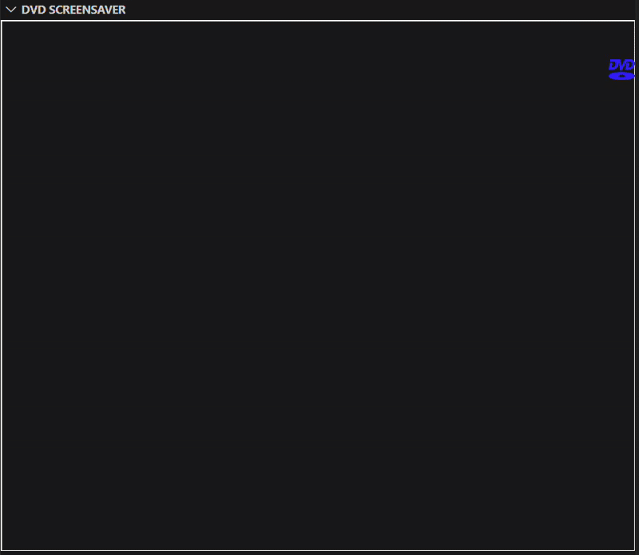

VS Code DVD Bouncer 

Make your code editor more fun with a DVD screensaver that bounces around your screen! 

Installation

1. Open Visual Studio Code.
2. Go to the Extensions view by clicking on the Extensions icon in the Activity Bar on the side of the window or by pressing `Ctrl+Shift+X`.
3. Search for "DVD Bouncer".
4. Click on the Install button to install the extension.

Using VS Code DVD Bouncer 

1. After installation, open the Command Palette by pressing `Ctrl+Shift+P`.
2. Type "Start DVD Bouncer" and select it to start the DVD screensaver.
3. The DVD logo will start bouncing around your primary sidebar. 

This fun project was inspired by [VS Code Pets](https://github.com/tonybaloney/vscode-pets?tab=readme-ov-file). 